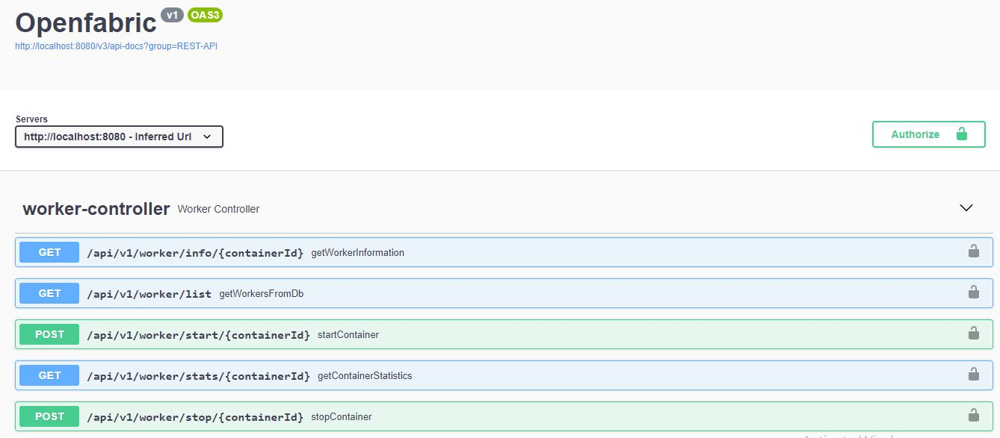

# Getting Started

> Clone the repository 

1. Change .env file with your own postgres credentials. 

2. Change the openfabric-api/src/main/resources/application-local.yaml 
    ```     
     datasource:
        url: jdbc:postgresql://localhost:5432/test
        username: <user>
        password: <password>
    ```    

3. Setup Docker
    > I used the latest docker nginx image. Pull the docker image with the command.
    `docker pull nginx:1.23`
    > Check the docker image 
    ```
    C:\Users\Admin>docker images
    REPOSITORY               TAG       IMAGE ID       CREATED        SIZE
    nginx                    1.23      448a08f1d2f9   10 days ago    142MB
    docker/getting-started   latest    3e4394f6b72f   4 months ago   47MB
    ```
    > Start the Docker Container
    `docker run nginx:1.23`

    > To get the Container Id
    `docker ps`

4. Run the project

Outcome :- 
    
   
